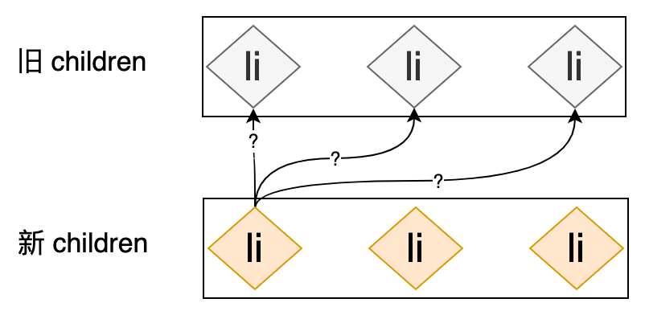
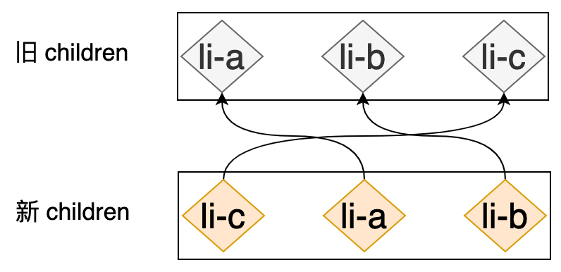

# patch 函数优化
- [patch 函数优化](#patch-函数优化)
  - [准备工作](#准备工作)
  - [简单的 diff 算法](#简单的-diff-算法)
  - [优化版本的 diff 算法](#优化版本的-diff-算法)
    - [新增节点](#新增节点)
    - [删除节点](#删除节点)
  - [关于核心 diff 算法](#关于核心-diff-算法)
    - [Vue 2 diff 算法](#vue-2-diff-算法)
    - [Vue 3 diff 算法](#vue-3-diff-算法)

## 准备工作
为了便于后续代码书写，我们先把处理数组 `children` 的功能挪至 `diffArrayChildren` 函数中，如下：
```js
function diffArrayChildren(oldChildren, newChildren, el) {
  for (let i = 0; i < oldChildren.length; i++) {
    el.removeChild(oldChildren[i].el)
  }
  for (let i = 0; i < newChildren.length; i++) {
    mount(newChildren[i], el)
  }
}
```

准备一个小小的示例。

我们假设有这样一段 `html`：
```html
<ul>
  <li>1</li>
  <li>2</li>
  <li>3</li>
</ul>
```
其对应的 `VNode` 如下，这里的示例代码计作“示例A”：
```js
const vdom1 = h('ul', null, [
  h('li', null, 1),
  h('li', null, 2),
  h('li', null, 3)
])
```
接着由于数据变化，导致其顺序变成了：
```js
const vdom2 = h('ul', null, [
  h('li', null, 3),
  h('li', null, 2),
  h('li', null, 1)
])
```

## 简单的 diff 算法
当前 `diffArrayChildren` 函数直接把这三个 `li` 进行了替换，并没有做什么复用，这是性能最差的一种方式。

我们有什么办法可以让这些 `li` 复用呢？`patch` 函数就是让 DOM 复用的，所以我们可以直接调用 `patch` 来比较新旧 `children` 的每一项，

用 `patch` 函数对其进行优化，优化后如下：
```js
function diffArrayChildren(oldChildren, newChildren) {
  for (let i = 0; i < newChildren.length; i++) {
    patch(oldChildren[i], newChildren[i])
  }
}
```
当前示例中由于新旧 `children` 长度相同，所以该方法完全行得通，但这里还有另外两种情况需要考虑：
- `newChildren.length > oldChldren.length`
- `oldChldren.length > newChildren.length`

这也很好实现，只对比共有长度的自己点，多出来的子节点调用 `mount` 挂载，减少的子节点就从其父元素上删除。

```js
function diffArrayChildren(oldChildren, newChildren, container) {
  const commonLen = Math.min(newChildren.length, oldChildren.length)
  for (let i = 0; i < commonLen; i++) {
    patch(oldChildren[i], newChildren[i])
  }
  if (newChildren.length > oldChildren.length) {
    newChildren.slice(oldChildren.length).forEach(child => {
      mount(child, container)
    })
  } else if (newChildren.length < oldChildren.length) {
    oldChildren.slice(newChildren.length).forEach(child => {
      container.removeChild(child.el)
    })
  }
}
```
我们在浏览器中打开“示例A”所示的代码，可以看到页面先显示了 `1,2,3`，1s 后变成了 `3,2,1`，效果符合预期。

现在的 `diffArrayChildren` 就算是**一个简单的 `diff` 算法**了，实际上，这个算法就是在没有 `key` 时所采用的算法，我们将其重新命名为 `patchUnkeyedChildren`：
```js
/**
 * @param c1 old old children
 * @param c2 new new children
 */
function patchUnkeyedChildren(c1, c2, container) {
  const commonLen = Math.min(c2.length, c1.length)
  for (let i = 0; i < commonLen; i++) {
    patch(c1[i], c2[i])
  }
  if (c2.length > c1.length) {
    c2.slice(c1.length).forEach(child => {
      mount(child, container)
    })
  } else if (c2.length < c1.length) {
    c1.slice(c2.length).forEach(child => {
      container.removeChild(child.el)
    })
  }
}
```

## 优化版本的 diff 算法
实际上，上面的示例中，很容易发现这三个 `li` 标签本质上只是顺序发生了变化，即使是最简单的替换 `textContent` 我们可以省略，所以最佳的操作应该是**通过移动元素的位置来达到更新**的目的。

下图所呈现的就是当前新旧 `children` 直接的关系，我们怎么判断其先后顺序呢？判断不了，因为其缺乏映射关系。



答案就是增加一个**唯一标识**来判断，这就是 Vue 中的 `key` 属性。

`h` 函数创建 `VNode` 是这样的：
```js
const vdom = h('li', { key: 'a' }, 1)
// vdom =
// {
//   _isVNode: true
//   el: null
//   shapeFlag: 1
//   tag: "li"
//   props: {key: 'a'}
//   children: 1
// }
```
`props` 中增加了 `key` 属性，但是为了方便读取，我们直接把 `key` 放到 `VNode` 本身上，修改 `h` 函数如下：
```js
function h(tag, props = null, children = null) {
  // ...
  const vnode = {
    _isVNode: true,
    el: null,
    shapeFlag,
    tag,
    props,
    key: props && props.key !== undefined ? props.key : null,
    children
  }
  normalizeChildren(vnode, vnode.children)
  return vnode
}
```

增加 `key` 后其先后 `children` 变成了如下，这里的示例代码计作“示例B”：
```js
const vdom1 = h('ul', [
  h('li', { key: 'a' }, 1),
  h('li', { key: 'b' }, 2),
  h('li', { key: 'c' }, 3)
])

const vdom2 = h('ul', null, [
  h('li', { key: 'c' }, 3),
  h('li', { key: 'b' }, 2),
  h('li', { key: 'a' }, 1)
])
```
> 注意这里 `key` 尽量不用 `index`，否则仍然无法获得其映射关系。

有了 `key` 我们就能够明确的知道新旧 `children` 中节点的映射关系，如下图所示：



有了这层映射关系，我们就很容易找到同一个 `key` 对应的先后节点能否复用。

首先 `patchChildren` 中增加有无 `key` 的判断，如下：
```js
function patchChildren(n1, n2, el) {
  // ...
  if (isString(oldChildren)) {
  } else if (isArray(oldChildren)) {
    const hasKey = newChildren[0].key !== null
    if (hasKey) {
      patchUnkeyedChildren(oldChildren, newChildren, el)
    } else {
      patchKeyedChildren(oldChildren, newChildren, el)
    }
  }
}
```
> 实际上 Vue 中判断有无 `key` 是给 `VNode` 增加一个 `patchFlag` 参数，在编译 `v-for` 时判断赋值。

我们通过 `key` 来找到前后对应的 `VNode`，代码如下：
```js
function patchKeyedChildren(c1, c2, container) {
  for (let i = 0; i < c2.length; i++) {
    const newChild = c2[i];
    for (let j = 0; j < c1.length; j++) {
      const oldChild = c1[j];
      if(newChild.key === oldChild.key){
        patch(oldChild, newChild)
        break
      }
    }
  }
}
```

我们在浏览器中打开“示例B”所示的代码，可以看到页面先显示了 `1,2,3`，1s 后变仍然显示 `1,2,3`，什么情况？其实现在节点的内容已经更新了，只是前后内容都是一样的，所以看不出效果，我们现在缺少的一步就是把更新后的节点放到正确的位置。

我们可以通过新旧节点的索引判断节点更新顺序，如 `abc -> cba`，其索引 `012 -> 210`，我们以新 `children` 的最后一个为基准，那么我们要做的额额就是把旧 `children[1].el` 插入到索引为 `children[0].el` 之前，把旧 `children[2].el` 插入到索引为 `children[1].el` 之前，依次类推。

实现代码如下：
```js
function patchKeyedChildren(c1, c2, container) {
  let indexArr = []
  for (let i = 0; i < c2.length; i++) {
    const newChild = c2[i];
    for (let j = 0; j < c1.length; j++) {
      const oldChild = c1[j];
      if (newChild.key === oldChild.key) {
        patch(oldChild, newChild)
        indexArr.push(j)
        break
      }
    }
  }

  sortChildrenElements(c1, c2, container, indexArr)
}

// n1.children = [el-a, el-b, el-c] => [el-c, el-b, el-a]
// indexArr 为新 children 索引列表[2,1,0]
// 这表示要把旧 children 中索引为1的元素插入到索引为0之前
function sortChildrenElements(c1, c2, container, indexArr) {
  let index = indexArr.length - 1
  while (index > 0) {
    // 把新children
    const lastChildNode = c1[indexArr[index]].el
    const prevChildNode = c1[indexArr[index - 1]].el
    container.insertBefore(prevChildNode, lastChildNode)
    index--
  }
}
```
首先在 `patchKeyedChildren` 函数中能够轻松获得新 `children` 的顺序，然后对 DOM 进行排序。现在在浏览器中查看效果，显示 `123`，1s 后变成了 `321`，符合预期。

和 `patchUnkeyedChildren` 一样，这里我们也需要考虑新旧 `children` 长度不一致的问题，也就是新增或删除了节点。

### 新增节点
**新增节点**，具体实现如下：
```js
function patchKeyedChildren(c1, c2, container) {
  let indexArr = []
  for (let i = 0; i < c2.length; i++) {
    let find = false // (*)
    const newChild = c2[i];
    for (let j = 0; j < c1.length; j++) {
      const oldChild = c1[j];
      if (newChild.key === oldChild.key) {
        patch(oldChild, newChild)
        find = true // (*)
        indexArr.push(j)
        break
      }
    }

    if(!find){ // (*)
      mount(newChild, container)
    }
  }

  sortChildrenElements(c1, c2, container, indexArr)
}
```
现在我们增加示例代码计作“示例C”，测试一下：
```js
const vdom1 = h('ul', null, [
  h('li', { key: 'a', class: 'red' }, 1),
  h('li', { key: 'b' }, 2),
  h('li', { key: 'c' }, 3)
])

const vdom2 = h('ul', null, [
  h('li', { key: 'c' }, 3),
  h('li', { key: 'd' }, 4),
  h('li', { key: 'b' }, 2),
  h('li', { key: 'a', class: 'green' }, 1),
])
```
可以看到页面先显示了 `1,2,3`，1s 后变仍然显示 `3,2,1,4`，新增的节点渲染出来了，但其位置并不符合预期，因为 `mount` 函数始终是往 `container` 的末尾添加元素。对于这种情况，我们可以用 `insertBefore` 的方式代替 `appendChild` 方法来达成目的，那么我们现在就需要知道把新增的节点插入到哪个节点之前。

思路：通过 `sortChildrenElements` 函数处理后现有复用节点都能够正常显示，比如“示例C”这样的，现在 `patchKeyedChildren` 得到的 `indexArr` 就应该是 `[2, 1, 0]`，但实际上我们需要的是 `[2, new1, 1, 0]` 这样的。现在我们只需要想办法找到 `new1` 处插入 `4` 即可，我们可以在发现新增节点时将其在新 `children` 中对应的位置存下来，最后挂载到相应位置。

我们的逻辑类似这样：
```js
function patchKeyedChildren(c1, c2, container) {
  let indexArr = []
  let addElements = []
  for (let i = 0; i < c2.length; i++) {
    // ...
    if(!find){
      addElements.push(i)
    }
  }

  sortChildrenElements(c1, c2, container, indexArr)
  insertNewElements(c1, c2, container, addElements)
}

function sortChildrenElements(c1, c2, container, indexArr) {
  // ...
}

function insertNewElements(c1, c2, container, addElements){
  for (let i = 0; i < addElements.length; i++) {
    const addElementIndex = addElements[i];
    // 先把新增节点渲染出来
    mount(c2[addElementIndex], container)
    // 然后调整新增节点位置
    container.insertBefore(c2[addElementIndex].el, container.children[addElementIndex - 1].nextSibling)  
  }
}
```
在浏览器中查看“示例C”的表现，新增的节点已经正常显示了。但是注意 `addElementIndex - 1`，如果新 `children` 第一项即为新增节点，这里显然会出错的，所以我们把这里修改成如下：
```js
function insertNewElements(c1, c2, container, addElements) {
  for (let i = 0; i < addElements.length; i++) {
    const addElementIndex = addElements[i];
    mount(c2[addElementIndex], container)
    if (addElementIndex === 0) {
      container.insertBefore(c2[addElementIndex].el, container.children[0])
    } else {
      container.insertBefore(c2[addElementIndex].el, container.children[addElementIndex - 1].nextSibling)
    }
  }
}
```
至此，一切都好了起来。

### 删除节点
接下来我们看一下**删除节点**的情况，具体实现如下：
```js
function patchKeyedChildren(c1, c2, container) {
  // ...

  // 删除节点
  for (let i = 0; i < c1.length; i++) {
    const exist = c2.find(child => child.key === c1[i].key)
    if(!exist){
      container.removeChild(c1[i].el)
    }
  }

  sortChildrenElements(c1, c2, container, indexArr)
  insertNewElements(c1, c2, container, addElements)
}
```
现在修改“示例C”代码如下：
```js
const vdom1 = h('ul', null, [
  h('li', { key: 'a', class: 'red' }, 1),
  h('li', { key: 'b' }, 2),
  h('li', { key: 'c' }, 3)
])

const vdom2 = h('ul', null, [
  h('li', { key: 'e' }, 5),
  h('li', { key: 'c' }, 3),
  h('li', { key: 'd' }, 4),
  h('li', { key: 'a', class: 'green' }, 1),
])
```
浏览器结果表现正常。

至此我们了解了 `patch` 函数在更新 DOM 时都做了什么样的操作，也就是所谓的 `diff` 算法，我们已经基本实现了一个渲染器。

## 关于核心 diff 算法

以上内容简单地对上一节提出的 `patch` 函数进行了优化，实际上这并不是 Vue 3 所采用的 `diff` 算法。但无论怎样，`diff` 算法的目的就是减少比较次数，增加 DOM 复用。

### Vue 2 diff 算法
Vue 2 核心 diff 算法采用的是双端比较。

感兴趣的同学可以：
- 学习优秀教程[Diff 算法](http://hcysun.me/vue-design/zh/renderer-diff.html#%E5%8F%A6%E4%B8%80%E4%B8%AA%E6%80%9D%E8%B7%AF-%E5%8F%8C%E7%AB%AF%E6%AF%94%E8%BE%83)。

### Vue 3 diff 算法

Vue 3 在 Vue 2 的基础上进行了大幅度的优化，在创建 `VNode` 时增加了 `patchFlag` 属性，这是**编译器生成**的优化性提示，当一个 `VNode` 带有动态子节点时，进入 `diff` 算法时会自动进入“优化模式”，它只会处理这些具有 `patchFlag` 标识的更新。而在 Vue 2 中是直接对整个 `VNode` 全面 `diff`。

在 Vue3 中将采用另外一种核心 Diff 算法，它借鉴于 [ivi](https://github.com/localvoid/ivi) 和 [inferno](https://github.com/infernojs/inferno)

感兴趣的同学可以：
- 直击源码[Vue 3 diff 算法](https://github.com/vuejs/vue-next/blob/master/packages/runtime-core/src/renderer.ts#L1537)。
- 学习优秀教程[Diff 算法](http://hcysun.me/vue-design/zh/renderer-diff.html#inferno-%E6%89%80%E9%87%87%E7%94%A8%E7%9A%84%E6%A0%B8%E5%BF%83-diff-%E7%AE%97%E6%B3%95%E5%8F%8A%E5%8E%9F%E7%90%86)。

现在我们可以回顾一下本章第一节中讲的内容，看一下编译器生成的 `render` 函数和手写有何区别，这些不同之处正是 Vue 为性能优化做出的额努力。

消化一下，下回继续～

[下一课 - 响应式原理及实现](../chapter4/OVERVIEW.md)
