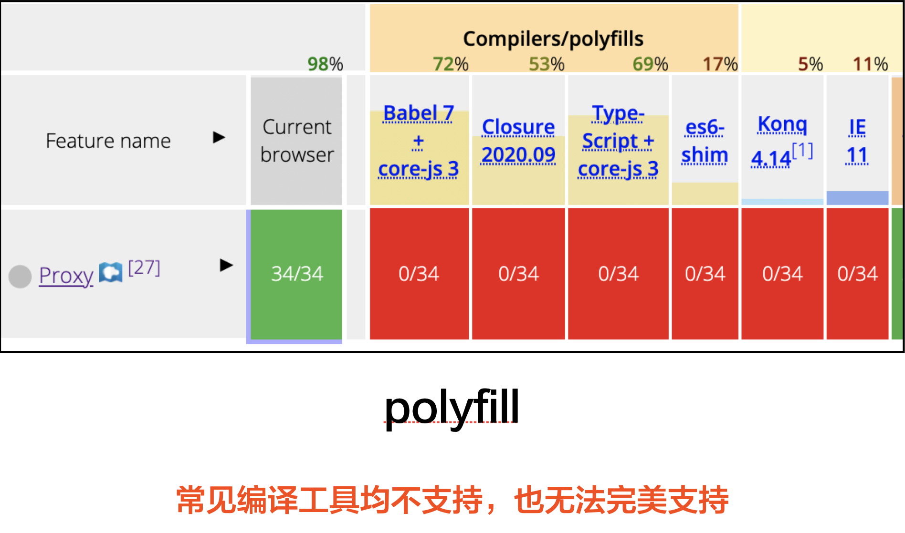

# 2. Proxy 和 Reflect
- [2. Proxy 和 Reflect](#2-proxy-和-reflect)
  - [Proxy](#proxy)
  - [Reflect](#reflect)
  - [实现 reactive 函数](#实现-reactive-函数)

上一节讲到了我们实现了基本的响应功能，但是我们目前还是手动进行依赖收集和触发更新的。

结合以下代码思考 3 秒钟：如何自动进行依赖收集和触发更新？

```javascript
let a = 1, c = 0
let effect = () => { c = a * 2 }

track() // 收集 effect
effect()
a = 2
trigger() // a 变化时，触发 effect 的执行
console.log('c:' + c) // 期望得到 4
```


结论：
- 当访问（`GET`）一个属性时，我们就调用 `track(obj, <property>)` 自动收集依赖项（存储 `effect`）
- 当修改（`SET`）一个属性时，我们就调用 `trigger(obj, <property>` 自动触发更新（执行存储的 `effect`）


那么现在问题就是，我们如何在访问或修改一个属性时做到这样的事情？也即是如何拦截这种 `GET` 和 `SET` 操作？

众所周知的是 Vue 2 使用 ES5 中的 `Object.defineProperty` 来拦截 `GET` 和 `SET`，Vue 3 使用 ES6 中的 `Reflect` 和 `Proxy`。

**为什么（能）用 Proxy？**





在这样严峻的条件下，为什么 Vue 3 还要使用 `Proxy` 呢？答案就是 **Vue 3 不再支持 IE 浏览器 **，所以可以用比较多的高级特性。

现在开始我们将为了上文的思考和结论而努力。先来看一下怎么获取对象的一个属性值，可以用下面这三种方法：
- 使用 `.` => `obj.a`
- 使用 `[]` => `obj['a']`
- 使用 ES6 中的 `Reflect` => `Reflect.get(obj, 'a')`

这三种方法都是可行的，但是 `Reflect` 有非常强大的能力，后面会讲到。

## Proxy
我们先来看看 `Proxy`，`Proxy` 是另一个对象的占位符，默认是对这个对象的委托。你可以在这里查看 [Proxy](https://developer.mozilla.org/zh-CN/docs/Web/JavaScript/Reference/Global_Objects/Proxy) 更详细的用法。
```js
let obj = {a: 1}
let proxiedObj = new Proxy(obj, {})
console.log(proxiedObj.a) // 1
```
这个过程可以表述为，获取 `proxiedObj.a` 时，直接去从查找 `obj.a` 然后返回给 `proxiedObj`，再输出 `proxiedObj.a`。

`Proxy` 的第二个参数被称为 `handler`，`handler` 就是包含捕捉器（trap）的占位符对象，即处理器对象，捕捉器允许我们拦截一些基本的操作，如：
- 查找属性
- 枚举
- 函数的调用

现在我们的示例代码修改为：
```js
let obj = {a: 1}
let proxiedObj = new Proxy(obj, {
  get(target, key) {
    console.log('Get')
    return target[key]
  }
})
console.log(proxiedObj.a) // 1
```
这段代码中，我们直接使用 `target[key]` 返回值，它直接返回了 **原始对象** 的值，不做任何其它操作，这对于这个简单的示例来说没任何问题。

现在我们看一下下面这段稍微复杂一点的代码：
```js
let obj = {
  a: 1,
  get b() { return this.a}
}

let proxiedObj = new Proxy(obj, {
  get(target, key, receiver) {
    return target[key] // 这里的 target 是 obj
  }
})

let childObj = Object.create(proxiedObj)
childObj.a = 2
console.log(childObj.b) // 期望得到 2 实际输出 1
```

这段代码的输出结果就是错误的，这是什么情况？难道是原型继承写错了吗？我们尝试把 `Proxy` 相关代码去掉，发现输出是正常的......
这个问题其实就出在 `return target[key]` 这一行：
1. 当读取 `childObj.b` 时，`childObj` 上没有属性 `b`，因此会从原型链上查找
2. 原型链是 `proxiedObj`
3. 读取 `proxiedObj.b` 时，会触发 `Proxy` 捕捉器（trap）中的 `get`，这直接从 **原始对象** 中返回了 `target[key]`
4. 这里 `target[key]` 中 `key` 是一个 `getter`，因此这个 `getter` 中的上下文 `this` 即为 target，这里的 `target` 就是 `obj`，因此直接返回了 `1`。

> 参考 [为什么要使用 Reflect](https://javascript.info/proxy?tdsourcetag=s_pctim_aiomsg#proxying-a-getter)

那么我们怎么解决这个 `this` 出错的问题呢？

## Reflect
现在我们就可以讲讲 `Reflect` 了。你可以在这里查看 [Reflect](https://developer.mozilla.org/zh-CN/docs/Web/JavaScript/Reference/Global_Objects/Reflect) 更详细的用法。


捕获器 `get` 有第三个参数叫做 `receiver`。

> `Proxy` 中 `handler.get(target, prop, receiver)` 中的参数 `receiver` ：`Proxy` 或者继承 `Proxy` 的对象。

> `Reflect.get(target, prop, receiver)` 中的参数 `receiver` ：如果 `target` 对象中指定了 `getter`，`receiver` 则为 `getter` 调用时的 `this` 值。

这确保了当我们的对象从另一个对象继承了值或函数时使用 `this` 值的正确性。

我们修改刚才的示例如下：
```js
let obj = {
  a: 1,
  get b() { return this.a}
}

let proxiedObj = new Proxy(obj, {
  // 本例中这里的 receiver 为调用时的对象 childOjb
  get(target, key, receiver) {
    // 这里的 target 是 obj
    // 这意思是把 receiver 作为 this 去调用 target[key]
    return Reflect.get(target, key, receiver)
  }
})

let childObj = Object.create(proxiedObj)
childObj.a = 2;
console.log(childObj.b) // 期望得到 2 实际输出 1
```

现在我们弄清楚了为什么要结合 `Reflect` 来使用 `Proxy`，有了这些知识，就可以继续完善我们的代码了。

## 实现 reactive 函数
现在修改我们的示例代码为：
```js
let obj = {a: 1}
let proxiedObj = new Proxy(obj, {
  get(target, key, receiver) {
    console.log('Get')
    return Reflect.get(target, key, receiver)
  }
  set(target, key, value, receiver) {
    console.log('Set')
    return Reflect.set(target, key, value, receiver)
  }
})
console.log(proxiedObj.a) // Get 1
```

接下来我们要做的就是结合 `Proxy` 的 `handler` 和 之前实现了的 `track`、`trigger` 来完成一个响应式模块。

首先，我们来封装一下 `Proxy` 相关代码，和 Vue 3 保持一致叫 `reactive`。
```js
function reactive(target) {
  const handler = {
    get(target, key, receiver) {
      return Reflect.get(target, key, receiver)
    },
    set(target, key, value, receiver) {
      return Reflect.set(target, key, value, receiver)
    }
  }
  return new Proxy(target, handler)
}
```

这里有一个问题，当我们每次调用 `reactive` 时都会重新定义一个 `handler` 的对象，为了优化这个，我们把 `handler` 提出去，代码如下：
```js
const reactiveHandler = {
  get(target, key, receiver) {
    return Reflect.get(target, key, receiver)
  },
  set(target, key, value, receiver) {
    return Reflect.set(target, key, value, receiver)
  }
}

function reactive(target) {
  return new Proxy(target, reactiveHandler)
}
```

现在把 `reactive` 引入到我们的第一节中最后的示例代码中。

```js
let obj = reactive({a: 10, b: 20})
let timesA = 0
let divideA = 0
let effectTimesA = () => { timesA = obj.a * 10 }
let effectDivideA = () => { divideA = obj.a / 10 }

track(obj, 'a')
trigger(obj, 'a')

console.log(`${timesA}, ${divideA}`) // 100, 1
obj.a = 100

trigger(obj, 'a')
console.log(`${timesA}, ${divideA}`) // 1000, 10
```

现在我们要做的是去掉示例代码中手动 `track` 和 `trigger` 相关的代码。

回到本节开头提出的解决方案，我们已经可以拦截 `GET` 和 `SET` 操作了，只需要在适当的时候调用 `track` 和 `trigger` 方法即可，我们修改 `reactiveHandler` 代码如下：
```js
const reactiveHandler = {
  get(target, key, receiver) {
    const result = Reflect.get(target, key, receiver)
    track(target, key)
    return result
  },
  set(target, key, value, receiver) {
    const oldVal = target[key]
    const result = Reflect.set(target, key, value, receiver)

    // 这里判断条件不对，result 为一个布尔值
    if(oldVal !== result){
      trigger(target, key)
    }
    return result
  }
}
```

现在我们的示例代码可以精简为这样：
```js
let obj = reactive({a: 10, b: 20})
let timesA = 0
let divideA = 0
let effectTimesA = () => { timesA = obj.a * 10 }
let effectDivideA = () => { divideA = obj.a / 10 }

// 恢复调用 effect 的形式
effectTimesA()
effectDivideA()

console.log(`${timesA}, ${divideA}`) // 100, 1
obj.a = 100

console.log(`${timesA}, ${divideA}`) // 1000, 10
```

现在我们已经实现了自动 `track` 和 `trigger` 代码，至此，我们已经实现了 `reactive` 函数，看起来和 Vue 3 源码差不多了。

但这还有点问题：
- `track` 函数中的 `effect` 现在还没处理，只能手动添加
- `reactive` 现在只能作用于对象，基本类型变量怎么处理？

下一个章节我们将解决这个问题，让我们的代码更加接近 Vue 3。

消化一下，下回继续～

[上一课 - 实现响应式](./1.REACTIVITY.md) ｜ [下一课 - activeEffect 和 ref](./3.ACTIVEEFFECT&REF.md)
